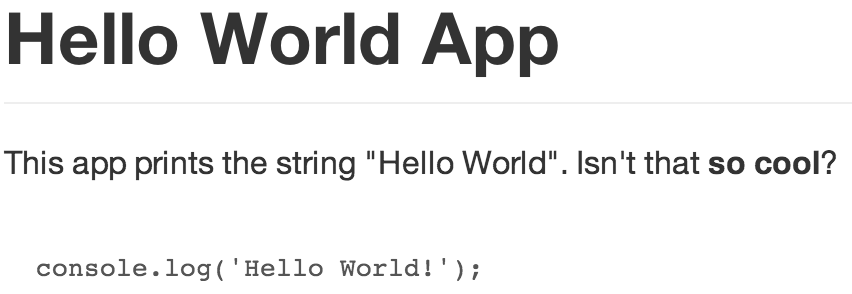

# gulp-literate

> Markdown files that happen to contain source code

## Install

```sh
$ npm install --save-dev gulp-babel
```

gulp-literate

## Example

[`main.lit.js`](example/main.lit.js)

```
# Hello World App
This app prints the string "Hello World".
Isn't that **so cool**?

    console.log('Hello World!');
```

 `main.lit.js` compiles with `gulp-literate` to

[`main.js`](example/code/main.js)
```js
console.log('Hello World!');
```

`main.lit.js` compiles with `gulp-markdown` to

[`main.html`](example/doc/main.html)
```
<h1 id="hello-world-app">Hello World App</h1>
<p>This app prints the string "Hello World". Isn't that **so cool**?</p>
<pre><code>console.log(&#39;Hello World!&#39;);</code></pre>
```

which, in a browser, looks like



The gulpfile for this example can be found [here](example/gulpfile.js).
